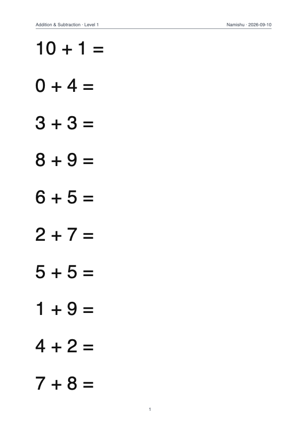

# Namishu Arithmetic

Printable arithmetic worksheets for integers, fractions, and decimals.

[简体中文](README.zh-CN.md)

Generate A4 PDFs for addition, subtraction, multiplication, division, mixed
operations, parentheses, and missing-number practice. Choose from **68 levels**
across three series. Worksheets are generated locally; no account or API key is required.



## Quick start

Requirements: **Python 3.10+**. Runtime dependencies: NumPy, PyYAML, and ReportLab.
Default configuration is included; PDF standard Helvetica requires no font files.
Python code is portable across
macOS, Linux, and Windows; see the CI workflow for the verification matrix.

Download or clone this repository, then open a terminal in its directory:

```bash
python -m venv .venv
```

Activate the environment on macOS/Linux:

```bash
source .venv/bin/activate
```

On Windows PowerShell:

```powershell
.venv\Scripts\Activate.ps1
```

Install and generate your first worksheet:

```bash
python -m pip install .
arithmetic generate --series addsub --level 1 --pages 5 --output worksheets/addition.pdf
```

The output path is printed after generation. Open that file with any PDF viewer
and print at actual size (A4). Level 1 uses operands from 0 to 10; **sums may reach 20**.

If you use `uv`, run `uv sync` followed by `uv run arithmetic generate` with the
same options. The project does not need to be published to PyPI to use either path.

## Let an agent generate worksheets

You do not need to write code if your agent can download this repository, run
shell commands, install dependencies, and give you access to the resulting files.
A chat-only assistant without those tools cannot perform the complete workflow.

Give a capable agent the repository URL or local folder and this request:

> Read README.md and AGENTS.md in this project. Set up the environment and generate
> five pages of basic multiplication practice without negative operands. Save the
> PDF in worksheets/. Use the documented series and levels, verify the PDF, and
> give me the file location and the settings you used.

Describe the operations, number types, whether negative operands are allowed,
and how many pages you want. The agent uses the [level catalog](docs/levels.md)
and [agent guide](docs/agent-guide.md) to choose a supported exercise.

For immediate use, download an example: [addition](examples/addition.pdf),
[multiplication](examples/multiplication.pdf), [fractions](examples/fractions.pdf),
[decimals](examples/decimals.pdf).

## Choose exercises

| Series | Levels | Content |
|---|---:|---|
| `addsub` | 1–24 | Integer addition, subtraction, negative numbers, missing numbers |
| `muldiv` | 1–26 | Integer multiplication/division, parentheses, mixed operations, missing numbers |
| `fraction` | 1–18 | Fractions, decimals, and mixed numeric types |

Level numbers identify exercise presets, not school grades or a strictly increasing
difficulty scale. `fraction` is a stable identifier and includes decimal exercises.

```bash
arithmetic list
arithmetic describe --series fraction --level 10
arithmetic generate --series fraction --level 10 --pages 2 --seed 42 --output worksheets/decimals.pdf
```

Every level has its own goal, source ranges, actual examples, page capacity, and
command in the [complete catalog](docs/levels.md) ([中文](docs/levels.zh-CN.md)).
Machine-readable equivalents are available through `list --json` and `describe --json`.

## Behavior and configuration

- Defaults: `addsub`, level 1, 10 pages; 10 problems/page for integer series,
  14 for the fraction series, with 12 for fraction levels 8, 9, 17, and 18.
- `--seed` repeats problem content within the same program/dependency versions;
  PDF dates and metadata mean PDF bytes need not match.
- Normal mode excludes undefined expressions and missing-number equations without
  a unique rational solution. A level's source range does not necessarily bound its answer.
- `--allow-undefined` enables optional division-by-zero recognition exercises and
  labels the PDF footer. It permits such examples but does not guarantee one on every page.
- Fractions are printed inline (`3/4`); decimals and fractions can be mixed.
- There are no answer sheets, arbitrary operand-range flags, or GUI in this release.
- Diversity selection reduces repetition; small pools can still produce repeated questions.

Use `--config examples/override.yaml` to merge layout and page-count settings with
the defaults. See [usage and configuration](docs/usage.md) for all options, path rules,
batch generation, Python usage, and troubleshooting.

## Development

```bash
uv sync
uv run pytest
uv run ruff check .
uv run ruff format --check .
uv run python scripts/build_catalog_docs.py --check
uv build
```

See [contributing](CONTRIBUTING.md) for contribution guidelines.

## License and generated PDFs

Project code and original documentation use the [MIT License](LICENSE), allowing
use, modification, redistribution, and commercial use under its terms.

Namishu permits you to print, share, modify, and sell the generated worksheets.
You do not need to attach the software license solely because you used this
program to generate a PDF. Third-party assets retain their own applicable terms.
No font files are distributed with this project. Installed dependencies retain their own licenses.
Using the software does not imply Namishu's endorsement of your materials.
